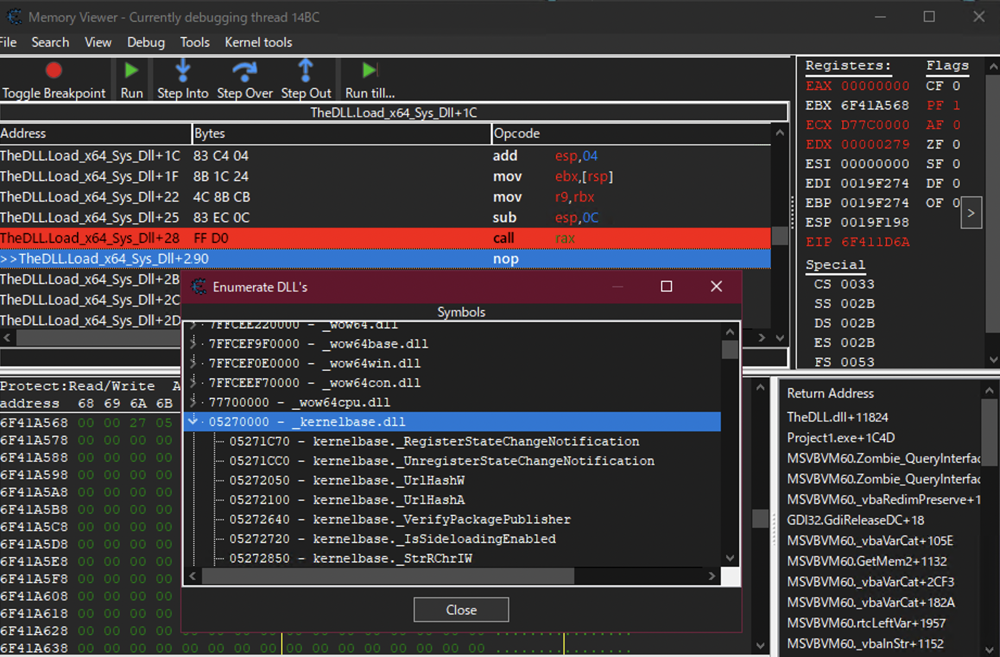

# Make VB6 Great Again

Visual Basic 6.0 is good, for easily creating GUI.

Load Native DLL in VB6, then do anything

Switching a CPU thread to x64 for a short time enabled modern features.

Screnshot:

## Current Achievements

- VB6 Load 32bit native DLL
- The DLL then run x64 code
- Then Load x64 DLL!
- Also Can Call x64 DLL Function

## Know Issues

- load x64 version of USER32.DLL will crash